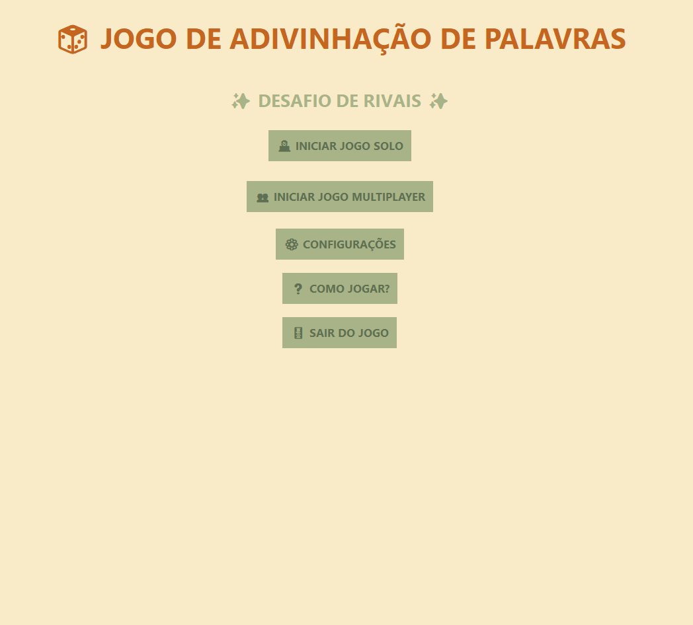

# Desafio de Rivais

Jogo de adivinhação de palavras em Python, com modos solo e multiplayer, ranking, integração com o Dicio para definições e interface amigável.


*Exemplo da tela de menu principal do jogo*

## Funcionalidades
- Modo Solo: adivinhe palavras sorteadas pelo sistema, com ranking e dificuldade.
- Modo Multiplayer: jogue com amigos, cada um define uma palavra para o outro adivinhar.
- Ranking Top 10 por dificuldade.
- Definição online das palavras pelo Dicio.
- Sons e música customizáveis.
- Interface confortável e responsiva.

## Requisitos
- Python 3.8+
- Bibliotecas: `requests`, `beautifulsoup4`, `pygame`

Instale as dependências com:
```bash
pip install -r requirements.txt
```

## Como jogar
1. Execute o arquivo principal:
   ```bash
   python Jogo.py
   ```
2. Escolha o modo de jogo (Solo ou Multiplayer).
3. Siga as instruções na tela para jogar, adivinhar palavras e desafiar seus amigos!

## Estrutura do Projeto
- `Jogo.py` — Código principal do jogo.
- `configuracoes.json` — Configurações do usuário.
- `palavras.txt`, `pt_BR.dic` — Dicionários de palavras.
- `ranking_solo.json` — Ranking do modo solo.
- `sons/` — Sons e músicas do jogo.

## Créditos
Desenvolvido por Max e colaboradores.

Definições de palavras fornecidas por [Dicio](https://www.dicio.com.br/).

---
Divirta-se e desafie seus rivais! 🚀 